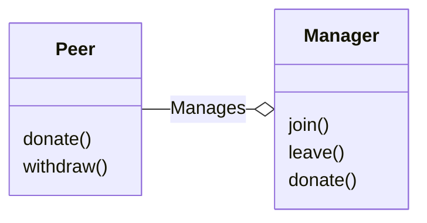
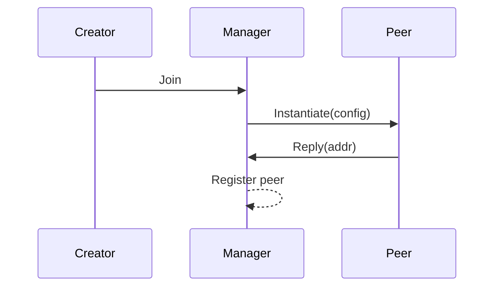
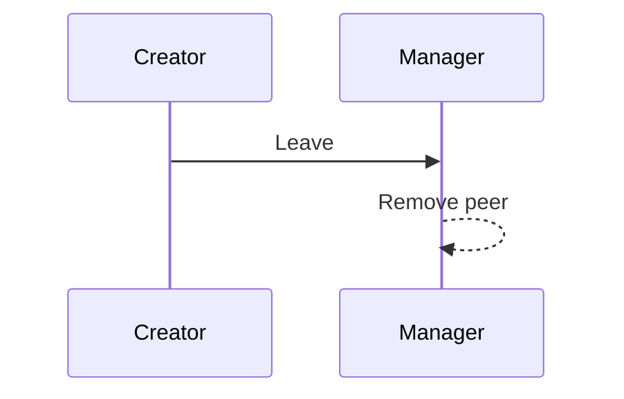
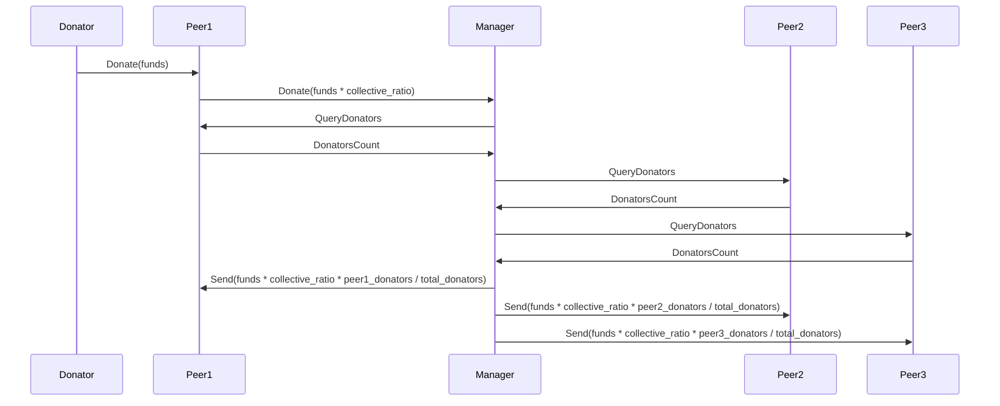
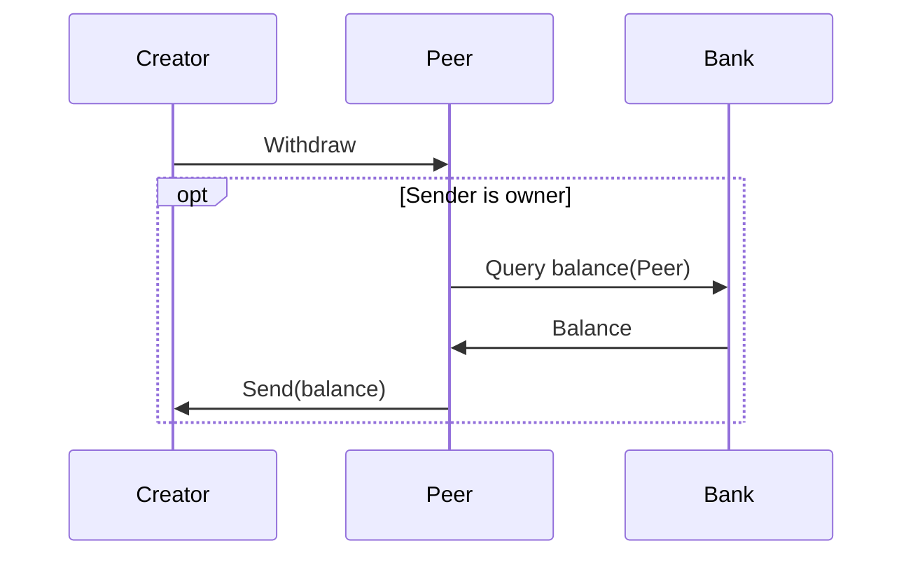
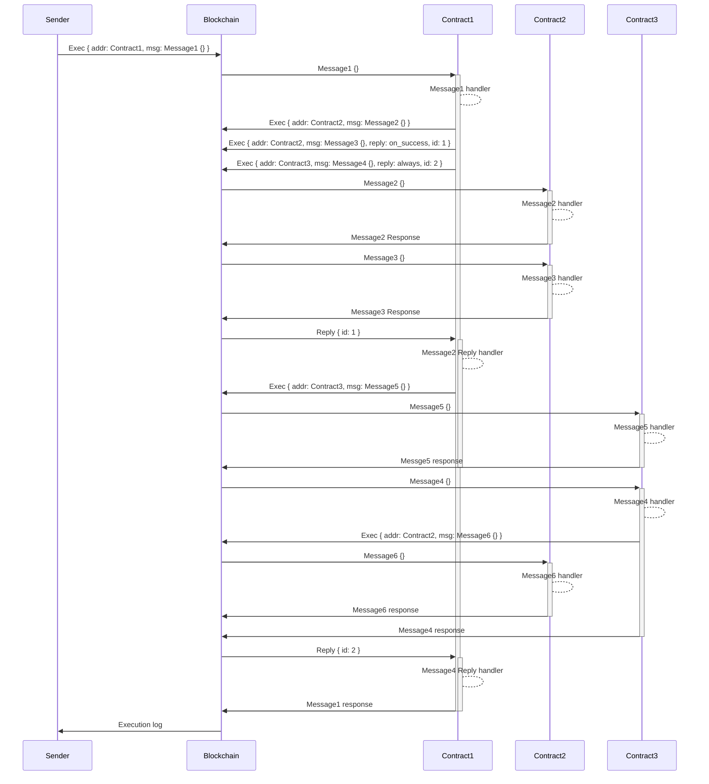

# CosmWasm Smart Contract Workshop

## Design

In the workshop, we would work on a smart contract system built out of two
contracts: the donation peer and the donations manager. The idea is simple: a
group of creators wants a common donation system. They want to share the
donations between each other to increase the donators pool, but at the same
time, peers with more donators should receive more significant parts of
donations.

Everyone is a part of the group has his own `peer` contract. It serves two
purposes: first, it is where donations end up, and the creator withdraws his
donations from this contract. Peer is also an API for donators - anyone can
send funds to the peer to increase the shares of this peer in rewards it
receives. Then part of the funds would stay on the peer contract itself, and
the rest of the donation would be sent to the `manager` contract.

Manager contract is the other part of the system. First of all, it distributes
received donations proportionally to peer contracts. Secondly, it is
responsible for creating peer contracts for creators.

Here is the graph of how contracts are related to each other:

Note: if you find this design a bit suspicious, you are probably right - there
are many problems with it, and in real life, it would probably be designed in a
slightly different way. But this is how I can show some common techniques
easily.

There are four flows in this contract. Let's start with the use-case of a new
creator joining the donation pool: 

Another very simple flow is the leaving one:

The clue of the system is the donation flow. Here is what it looks like:

The last flow to implement is the withdrawal flow. It would not be very complicated:

## Contracts communication

Here is a brief description of how contracts communicate in the CosmWasm
ecosystem.

Contract communication is based on the actor model. Every single contract is an
actor, and it can perform some executions. The single part of work it performs
can never be interrupted.

When the contract finishes its job, it can schedule additional work for other
contracts - it prepares messages to be executed by them (or the blockchain
itself - e.g., bank messages) in the exact order there were scheduled. Handling
the following message can begin only after handling the previous one is fully
complete and successful. When executing of scheduled sub-message is done, its
response can be processed. After processing the response (or receiving it if
the response is not processed), if it succeeds, the sub-message processing is
considered done, and the next one is handled.

What is critical is transactional of this execution - any changes happening
while processing the message are applied to the temporary cache. The cache is
then applied to the blockchain after completing all scheduled sub-messages.
That has significant consequences:

* It's never possible that a contract ends up in the state when its changes are
  applied to the blockchain, but its subsequent calls changes are not.
* It's never possible that sub-message processing fails, but contract changes
  are applied to the blockchain.

But there is another plot twist here: the sub-message execution is considered
to succeed when its reply handling succeeds. It means that it is possible that:

* Sub-message processing succeeds, but handling its response, we decide that
  the effect is not satisfying and fail at this point.
* Sub-message processing fails, but in reply handler, we treat it as a win
  scenario and proceed with success.

When sub-messages responses are not processed, their result is passed directly
as a processing result (so default processing is just forwarding the result.

What is worth mentioning as it can be sometimes useful - handling the message
response is a normal execution step, so it can normally schedule another
sub-messages. It prolongs the handling of the original message until the new
scheduled message is handled.

To distinguish responses, messages use the notion of `id`. Sending sub-message,
if the response is meant to be handled, the id is assigned to it. A reply
message would be sent with the same `id`. The diagram below visualizes this
flow:

