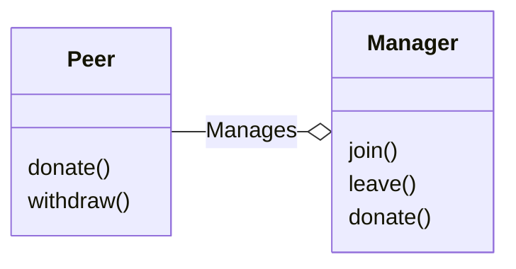
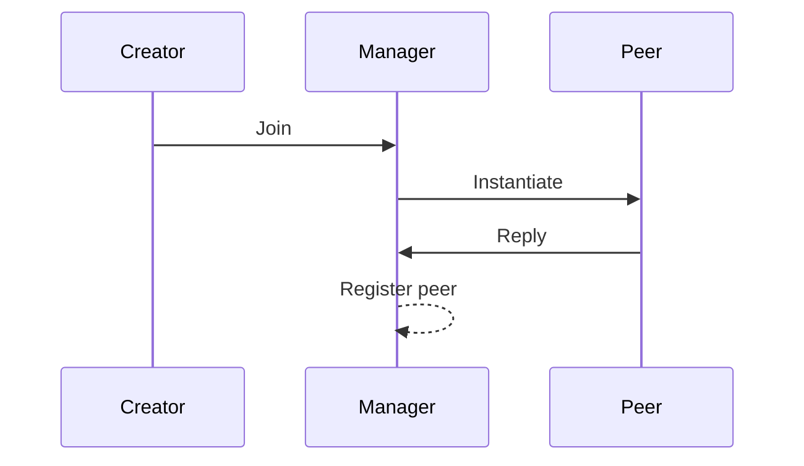

# CosmWasm Smart Contract Workshop

## Design

In the workshop, we would work on a smart contract system built out of two
contracts: the donation peer and the donations manager. The idea is simple: a
group of creators wants a common donation system. They want to share the
donations between each other to increase the donators pool, but at the same
time, peers with more donators should receive more significant parts of
donations.

Everyone is a part of the group has his own `peer` contract. It serves two
purposes: first, it is where donations end up, and the creator withdraws his
donations from this contract. Peer is also an API for donators - anyone can
send funds to the peer to increase the shares of this peer in rewards it
receives. Then part of the funds would stay on the peer contract itself, and
the rest of the donation would be sent to the `manager` contract.

Manager contract is the other part of the system. First of all, it distributes
received donations proportionally to peer contracts. Secondly, it is
responsible for creating peer contracts for creators.

Here is the graph of how contracts are related to each other:

Note: if you find this design a bit suspicious, you are probably right - there
are many problems with it, and in real life, it would probably be designed in a
slightly different way. But this is how I can show some common techniques
easily.

There are four flows in this contract. Let's start with use-case of new creator
joining donation pool:

